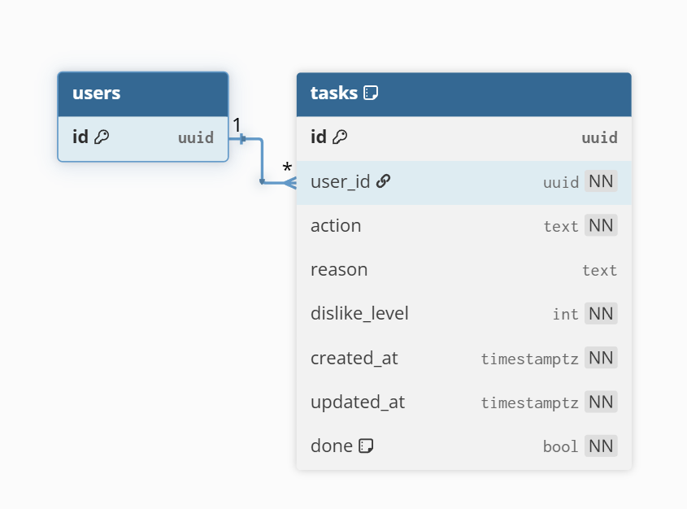
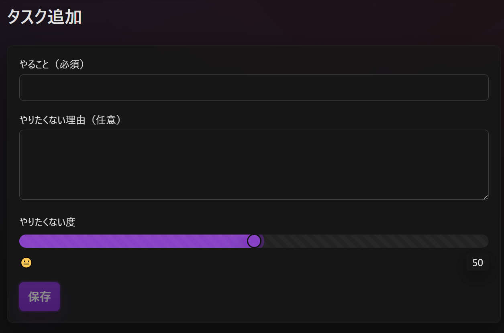
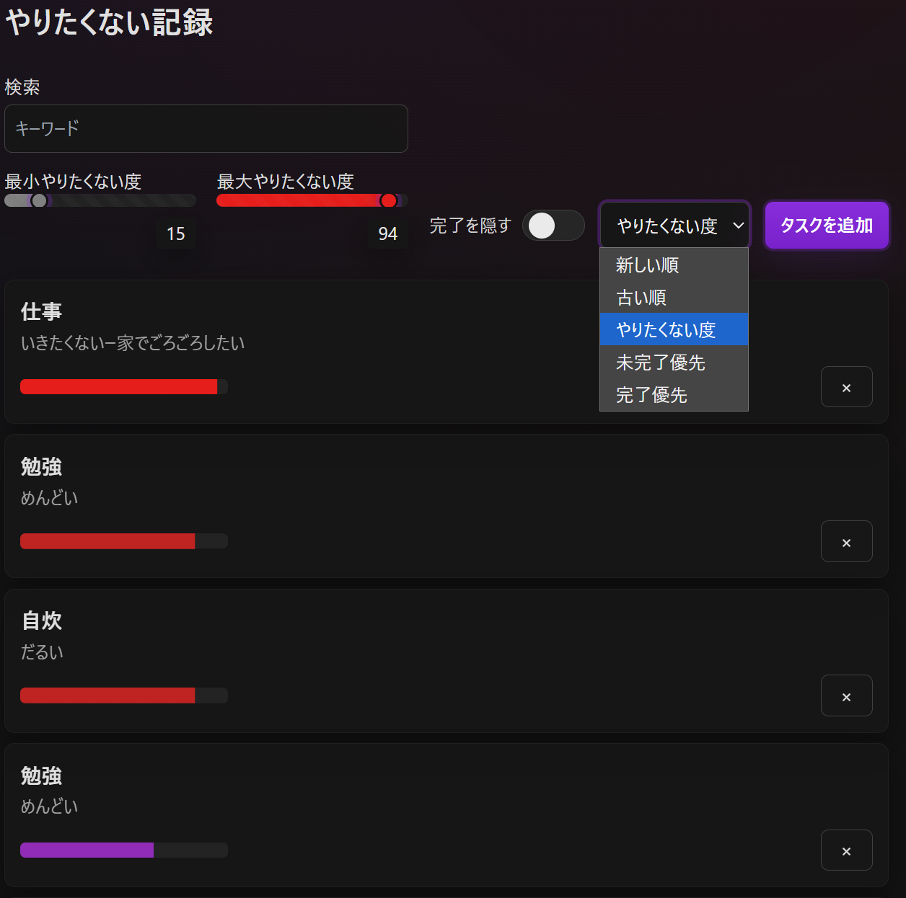
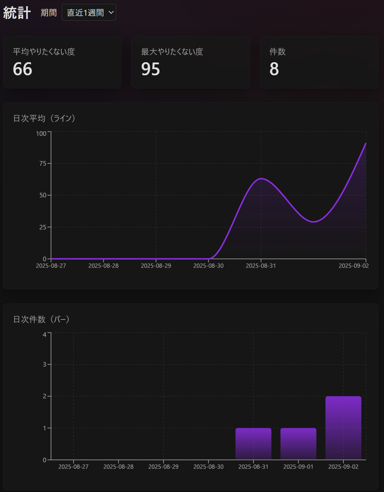
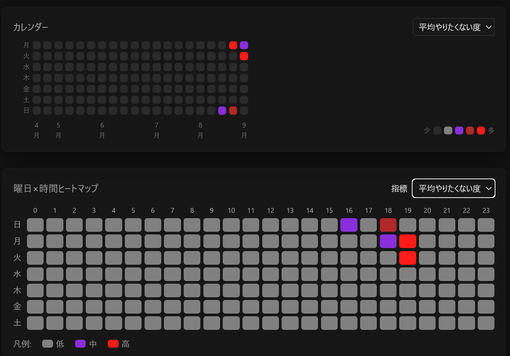

# やりたくないよ！（仮）

## 📖 概要
「やること」と「やりたくない理由」をセットで記録できるToDoアプリです。  
ポジティブな自己管理ではなく、本音や毒をそのまま残すことで、自己理解と精神の整理を促します。  

- 行動（やること）＋感情（やりたくない理由）の二面性を記録
- 「やりたくない度」メーター（0〜100%）で直感的に可視化
- 統計機能によりストレスチェッカ―に

---

## 🎯 主な機能
- タスク追加（やること／理由／やりたくない度スライダー）
- 一覧表示（表情アイコン＋やりたくない度バー、検索・フィルタ・ソート）
- 詳細表示・編集・削除
- 統計（週／月ごとの平均・最大傾向）
- 認証（Supabase Auth：メール／Magic Link）

---

## 🛠 技術スタック
- **フロントエンド**: Next.js (App Router), TypeScript, Tailwind CSS  
- **バックエンド**: Supabase (PostgreSQL, Auth, RLS)  
- **状態管理**: React Query,
- **グラフ**: Recharts  
- **デプロイ**: Vercel  

---

## 🗂 アーキテクチャ

---

## 📊 ER図

- `tasks` テーブル  
  - `id`: 主キー (uuid)  
  - `user_id`: ユーザーID (auth.users.id を参照)  
  - `action`: やること  
  - `reason`: やりたくない理由  
  - `dislike_level`: やりたくない度 (0〜100)  
  - `done`: 完了フラグ  
  - `created_at`, `updated_at`: タイムスタンプ

---

## 📂 ディレクトリ構成
src/
  app/
    add/          # タスク追加ページ
    auth/         # 認証ページ (ログイン/サインアウト)
    stats/        # 統計画面
    task/         # タスク詳細  (動的ルート)
    globals.css   # Tailwind 共通スタイル
    layout.tsx    # 共通レイアウト
    page.tsx      # 一覧（トップページ）
  components/     # 再利用可能なUI部品
  lib/            # Supabaseクライアント, APIラッパ
supabase/         # migrationファイル (テーブル, インデックス, RLS設定)

Next.js (App Router) の構成に従って、`src/app/` 以下のディレクトリがそのままルーティングになります。

---

## 📷 スクリーンショット

### タスク追加

### 一覧

### 統計

